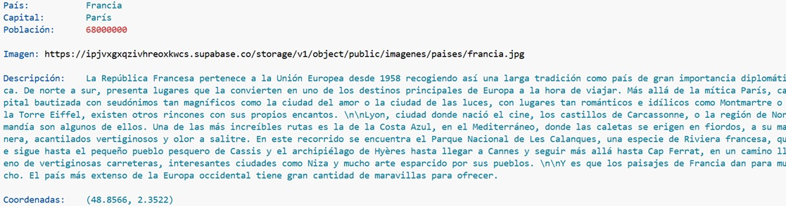
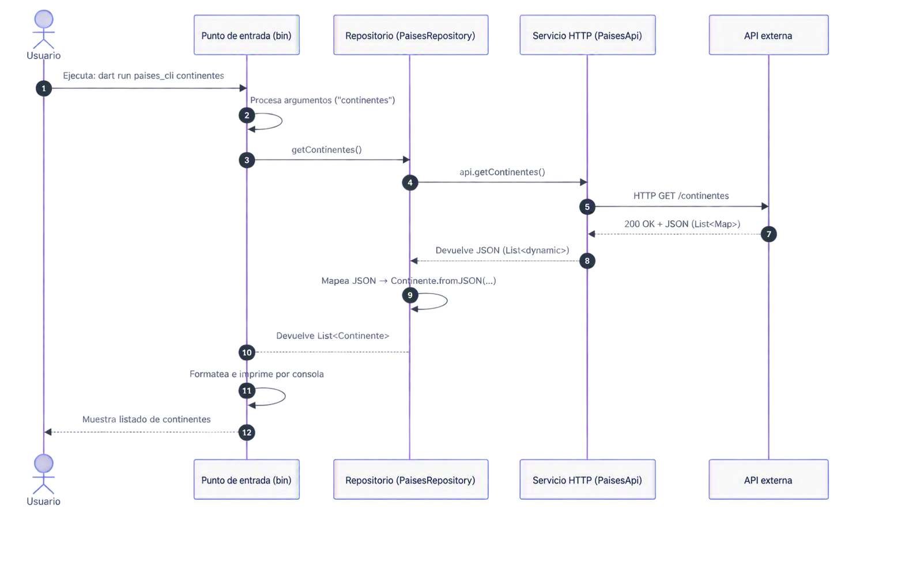

   

<a id="_apartado1"></a>

# Flutter. Práctica 2. 

Vamos a crear una pequeña aplicación (`paisescli`) de consola con el fin de obtener información sobre los continentes y países del mundo.

Nuestra aplicación ofrecerá desde la línea de órdenes tres funcionalidades:

- Obtener la **lista de continentes**, con una imagen representativa de cada uno,

- Obtener un **listado de países** para un continente dado, con una imagen representativa de cada país, y

- Obtener información detallada sobre un **país** en concreto.

Para ello, nuestra aplicación recibirá varios argumentos por la línea de órdenes, actuando el primero como suborden que nos indica el tipo de consulta a realizar (**continentes, paises e infopais**), y el resto los argumentos que ésta necesita: el nombre del continente para obtener el listado de países, o el nombre del país para obtener su información detallada. La obtención de la lista de continentes no necesitará ningún argumento adicional.

Veamos algunos ejemplos:

- Para obtener la lista de continentes, haremos:

```
dart run paisescli continentes
```

- Para obtener la lista de países de Europa, haremos:

```
dart run paisescli paises Europa
```

- Y con el fin de obtener información sobre España, haremos:

```
dart run paisescli infopais España
```

Debemos tener en cuenta que si utilizamos nombres de países compuestos, habrá que escribirlos entre comillas dobles.

```
dart run paisescli infopais "Estados Unidos"
```

## Consideraciones sobre la API

Para obtener la información sobre los continentes y países haremos uso de la API REST proporcionada para la práctica.

Concretamente, utilizaremos las siguientes rutas:

- [https://api-paises-uagm.onrender.com/continentes](https://api-paises-uagm.onrender.com/continentes)

- [https://api-paises-uagm.onrender.com/paises/\$continente](https://api-paises-uagm.onrender.com/paises/$continente)

- [https://api-paises-uagm.onrender.com/infopais/\$pais](https://api-paises-uagm.onrender.com/infopais/$pais)
  
La ruta `/continentes` devolverá el listado de continentes disponibles junto con una imagen representativa de cada uno.

La ruta `/paises/$continente` devolverá el listado de países pertenecientes al continente indicado, incluyendo una imagen representativa de cada país.

Por último, la ruta `/infopais/$pais` devolverá información detallada sobre un país concreto.

## Arquitectura de la aplicación. Aproximación a la arquitectura de aplicaciones de Flutter

En unidades posteriores trabajaremos la [arquitectura recomendada para aplicaciones Flutter](https://docs.flutter.dev/app-architecture/guide). De momento trabajamos con una simplificación de esta arquitectura.

La estructura básica del proyecto que ya se os proporciona como base es la siguiente:

```text
.
├── bin
│   └── paisescli.dart
├── lib
│   ├── data
│   │   ├── repositories
│   │   │     └── paises_repository.dart   
│   │   └──  services
│   │         └── paises_api.dart   
│   └── domain   
│        └── entities
│             ├── continente.dart
│             └── pais.dart
├── pubspec.yaml
└── README.md
...

```

Esta estructura sigue una arquitectura en tres capas principales, cada una con una responsabilidad clara y definida:

- La capa de interacción con el usuario,
- La capa de Dominio, y
- La capa de Datos, que consta de dos subcapas: La subcapa de Servicio i la subcapa de Repositorio.
  
La relación entre las capas es la siguiente:

 

### Capa de interacción con el usuario

Esta capa tiene la responsabildad de interactual con el usuario y coordinar la ejecución del programa.

El fichero principal `bin/paisescli.dart` contiene la funcionalidad principal de la aplicación: recoge lo que le proporcionamos por la línea de órdenes y hace uso del resto de clases y funciones para mostrar los resultados.

### Capa de Dominio

Representa la capa central de la aplicación, y contiene la lógica de negocio y las entidadesd del dominio. Esta capa es representa a la carpeta `lib/domain`.

Cuando la lógica de negocio es compleja, se puede introducir en esta una subcapa de casos de uso (`usecases`),que encapsulan esta lógica de negocio. En nuestro caso no vamos a utilizar esa capa.

Lo que sí que vamos a utilizar son las Entidades del dominio, ubicadas en la carpeta `lib/domain/entities`. Son las clases que representan los conceptos principales de nuestro negocio.

- Los ficheros `lib/domain/entities/pais.dart` y `lib/domain/entities/continente.dart` contienen las clases `Pais` y `Continente` respectivamente, que detallaremos a continuación.

**La clase Continente**

La clase `Continente` que ya se os proporciona implementada, contiene dos atributos de tipo `String`: el nombre y la imagen (opcional):

```dart
class Continente {
  late String nombre; // Declaramos el nombre , e indicamos que lo inicializaremos después
  String? imagen; // La url de la imagen es nulable
...
}
```

Ésta contiene un constructor por defecto, con argumentos con nombre, y un constructor con nombre, para crear el continente a partir del JSON:

```dart
  /* 
  Constructor con argumentos por nombre: 
   - nombre es obligatorio, e 
   - imagen opcional.
  */
  Continente({
    required this.nombre,
    this.imagen,
  });

  /* 
  Constructor con nombre a partir de un diccionario.
  */
  Continente.fromJSON(Map<String, dynamic> objetoJSON) {
    nombre = objetoJSON["nombre"] ?? "";
    imagen = objetoJSON["imagen"] ?? "";
  }
```

**La clase Pais**

Habrá que implementar una clase Pais, que guardará la información del país cuando se hace una consulta.
Esta clase tendrá las siguientes propiedades:

- `nombre`, de tipo `String`, que será el nombre del país,
  
- `capital`, de tipo `String`,
  
- `poblacion`, de tipo `String`, que contendrá la cantidad de habitantes. A pesar de tratarse de una cantidad, ya que la API nos lo proporciona en formato String,
  
- `imagen`, de tipo `String`,
  
- `descripcion`, de tipo `String`,
  
- `latitud`, de tipo `double`,
  
- `longitud`, de tipo `double`.
  
Todas las propiedades de la clase, salvo `nombre` podrán ser nulas.

Esta clase soportará dos constructores:

- Un constructor `Pais` con argumentos con nombre, donde todos serán opcionales, salvo `nombre` (requerido).
  
- Un constructor con nombre `Pais.fromJSON`, que recibirá un JSON a partir del cual se inicializará.
Además, se sobreescribirá el método `toString`, para devolver un `String` con la información del país formateado, de la siguiente forma:

<br>

 

<br>

Cuando se reciba respuesta a la petición HTTP pidiendo información sobre un país, deberemos crear un objeto de la clase `Pais`. Posteriormente, cuando vamos a mostrar el resultado, haremos uso del método `toString` que hemos sobreescrito en esta clase.

### Capa de Datos

La capa de datos se encarga de gestionar el acceso a los datos externos (APIs, bases de datos, ficheros...). Esta capa se divide en dos subcapas: la capa de servicios y la capa de repositorio.

En nuestro proyecto, tenemos dividida esta capa en la siguiente estructura de carpetas:

```text
data
├── repositories
│     └── paises_repository.dart   
└──  services
      └── paises_api.dart   

```

**Subcapa de servicios**

Los servicios son clases que se encargan de la comunicación con fuentes de datos externas. En este caso, la clase `PaisesAPI` (fichero paises_api.dart) gestiona las peticiones HTTP a la API (GET, procesar respuestas, gestionar errores...).

La responsabilidad de esta subcapa es la de comunicarse con la API, procesar el JSON de respuesta y devolverlo.

De manera resumida la clase PaisesAPI:

```dart
class PaisesApi {
  String urlBase;

  Future<List<dynamic>> getContinentes(): async
  Future<List<dynamic>> getPaises(String continente): async 
  Future<dynamic?> infoPais(String pais): async 
}

```

- `getContinentes()`: Devuelve la lista completa de continentes, generada a partir de la respuesta obtenida en la ruta `/continentes`. **Ya implementado**.
  
- `getPaises(String continente)`: Devuelve la lista de paises de un continente. Lista de objetos dinámicos a partir de la respuesta obtenida en la ruta `/paises/$continente`. **Por implementar**.

- `infoPais(String pais)`:Devuelve la información de un país. a partir de la petición web a la ruta `/infopais/$pais`. **Por implementar**.


<br>

**Subcapa de repositorio**

Los repositorios actúan como intermediarios entre la capa de datos y el resto de la aplicación.

Son responsables de la obtención de datos de la API (o de la fuente de datos que se use), transformar esta información en entidades del dominio y proporcionarlas al resto de la aplicación.

Esta capa nos permite abstraer e independizar el código desde donde vienen los datos del resto de la aplicación: el código que utiliza los datos (entidades de dominio) ne tiene por qué saber de donde vienen.

```dart
class PaisesRepository {
  String urlBase;
  PaisesApi api;

  Future<List<Continente>> getContinentes(): async
  Future<List<Pais>> getPaises(String continente): async 
  Future<Pais> infoPais(String pais): async
}

```


Es interesante observar que los métodos son los mismos que ofrece la subcapa de servicio, con la diferencia que el repositorio devuelve objetos que están en el dominio de la aplicación (`Continente`, `Pais`), en lugar `dynamic` que se utilizar en la subcapa de servicio.

Es decir, podemos ver como este repositorio está haciendo de intermediario y traduciendo la representación interna de los datos que nos devuelve la API (diccionarios JSON) a los objtos con los que trabaja nuestra aplicación.

Veamos, a modo de ejemplo, cómo haríamos una petición de los continentes:

 

Aunque esta organización puede parecer compleja para un programa sencillo, tiene importantes ventajas:

- Separación de responsabilidades: Cada capa hace únicamente una cosa
- Mantenimiento más sencillo: Si cambia la API únicamente hay modificar `paises_ap.dart`
- Facilidad de testeo en cada capa de manera independiente
- Escalabilidad: Es fácil añadir nuevas fuentes de datos (caché, fichero, base de datos local...)


## El fichero principal `paisescli.dart`

### Tratamiento de argumentos

En el fichero principal del proyecto de base ya se realiza la captura de argumentos y se decide cuál es la orden o acción a realizar a través del primer argumento (**continentes, paises o infopais**). El resto de argumentos representarán bien el nombre del continente o el del país, según el caso.

Para obtener la orden y el resto de argumentos, lo que hacemos es obtener una copia de la lista de argumentos, guardarnos el primero como la orden, eliminarlo de la lista y combinar (con `join`) el resto de argumentos para obtener nombres compuestos (por ejemplo, "Estados Unidos").

```dart
// Parseamos la lista de argumentos
List<String> listaArgs = List.from(argumentos);
String? orden;
String? args;

// Separamos la orden (continentes, paises, infopais) de la lista de argumentos
orden = listaArgs[0];
listaArgs.removeAt(0);
args = listaArgs.join(" ");
```

El hecho de hacer una copia de la lista de argumentos y no trabajar directamente con estos es para poder utilizar el método `removeAt()` de la clase `List`, lo cual no se puede hacer directamente con la lista de argumentos del programa.

Después de esto, el programa discrimina qué queremos hacer mediante un `switch` e invoca la función apropiada para ello, comprobando y proporcionándole los argumentos que necesita:

```dart
switch (orden) {
  case "continentes":
    muestraContinentes();        // Implementación con Future
    // muestraContinentesSync(); // Implementación con async/await
    break;

  case "paises":
    if (argumentos.length != 2) {
      print(
          "\x1B[31mNúmero de argumentos incorrecto. Hay que especificar el continente.\x1B[0m");
      exit(-1);
    }
    muestraPaises(args);
    break;

  case "infopais":
    if (argumentos.length < 2) {
      print(
          "\x1B[31mNúmero de argumentos incorrecto. Hay que especificar el país.\x1B[0m");
      exit(-1);
    }
    muestraInfoPais(args);
    break;

  default:
    print("\x1B[31mOrden desconocida\x1B[0m");
}
```

Las funciones `muestraContinentes` y `muestraContinentesSync` ya se os proporcionan implementadas, y son las encargadas de obtener y mostrar los continentes, cada una utilizando una técnica diferente.

`muestraContinentes()` hace uso del tratamiento de `Future`, mientras que `muestraContinentesSync()` utiliza `async/await`.

Vuestra tarea será implementar las funciones `muestraPaises()` y `muestraInfoPais()`, haciendo uso de uno u otro mecanismo.

## Pintando la salida

Si deseamos pintar la salida, podemos hacer uso de los códigos de escape ANSI para los siguientes colores:

```
Negro:   \x1B[30m
Rojo:    \x1B[31m
Verde:    \x1B[32m
Amarillo:    \x1B[33m
Azul:    \x1B[34m
Magenta: \x1B[35m
Cyan:    \x1B[36m
Blanco:   \x1B[37m
Reset:   \x1B[0m
```

Por ejemplo, para imprimir un texto en rojo haríamos:
print("\x1B[31mTexto en rojo\x1B[0m");

